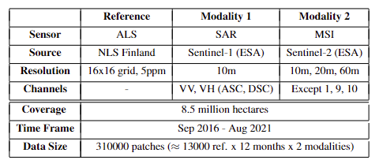

## BioMassters: A Benchmark Dataset for Forest Biomass Estimation using Multi-modal Satellite Time-series (NeurIPS 2023)

Above Ground Biomass is an important variable as forests play a crucial role in mitigating climate change as they act as an efficient, natural and cost-effective carbon sink. Traditional field and airborne LiDAR measurements have been proven to provide reliable estimations of forest biomass. Nevertheless, the use of these techniques at a large scale can be challenging and expensive. Satellite data have been widely used as a valuable tool in estimating biomass on a global scale. However, the full potential of dense multi-modal satellite time series data, in combination with modern Deep Learning (DL) approaches, has yet to be fully explored. The aim of the "BioMassters" data challenge and benchmark dataset is to investigate the potential of multi-modal satellite data (Sentinel-1 SAR and Sentinel2 MSI) to estimate forest biomass at a large scale using the Finnish Forest Centre’s open forest and nature airborne LiDAR data as a reference. The performance of the top three baseline models shows the potential of DL to produce accurate and higher-resolution biomass maps. 
## Dataset 
### Feature data: 
* Sentinel-1 SAR and Sentinel-2 MSI data
* 12 months of data (1 image per month)
* Total 310,000 patches
### Reference data: 
* Reference AGB measurements were collected using LiDAR (Light Detection and Ranging) calibrated with in-situ measurements.
* Total 13000 patches, each patch covering 2,560 by 2,560 meter area.
  
!
### Data Specifications:

### Data Size ([Download link](https://huggingface.co/datasets/nascetti-a/BioMassters/tree/main)):
```
  dataset         | # files  | size
  --------------------------------------
  train_features  |  189078  | 215.9GB
  test_features   |   63348  |  73.0GB
  train_agbm      |    8689  |   2.1GB
```
## Baseline codes
https://github.com/drivendataorg/the-biomassters
## Citation:
```
@inproceedings{nascetti2023biomassters,
  title={BioMassters: A Benchmark Dataset for Forest Biomass Estimation using Multi-modal Satellite Time-series},
  author={Nascetti, Andrea and Yadav, Ritu and Brodt, Kirill and Qu, Qixun and Fan, Hongwei and Shendryk, Yuri and Shah, Isha and Chung, Christine},
  booktitle={Thirty-seventh Conference on Neural Information Processing Systems Datasets and Benchmarks Track},
  year={2023}
}
```

